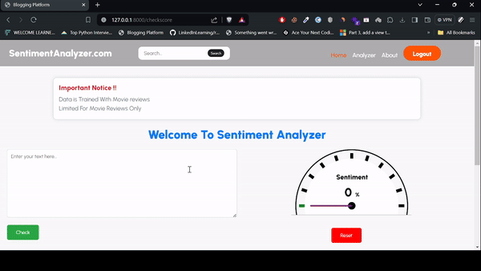

 <head>
    
</head>
<body>

    <h1>Sentimental Analyzer</h1>

    
    
    

    
Welcome to Sentimental Analyzer! This application allows you to analyze text sentiment, providing both positive and negative scores represented in charts and a sentiment analyzer meter. Below are the instructions to set up and use the project effectively.

    <h2>Installation</h2>

    <ol>
        <li>Clone the repository:</li>
        <pre><code>git clone &lt;repository_url&gt;</code></pre>
        <li>Navigate to the project directory:</li>
        <pre><code>cd SentimentalAnalyzer</code></pre>
        <li>Set up a virtual environment (optional but recommended):</li>
        <pre><code>python3 -m venv venv</code></pre>
        <li>Activate the virtual environment:</li>
        <ul>
            <li>On Windows:</li>
            <pre><code>venv\Scripts\activate</code></pre>
            <li>On macOS and Linux:</li>
            <pre><code>source venv/bin/activate</code></pre>
        </ul>
        <li>Install the required dependencies:</li>
        <pre><code>pip install -r requirements.txt</code></pre>
    </ol>

    <h2>Usage</h2>

    <ol>
        <li>Run the Django development server:</li>
        <pre><code>python manage.py runserver</code></pre>
        <li>Access the application in your web browser at <code>http://localhost:8000/</code>.</li>
        <li>Navigate through the following pages:</li>
        <ul>
            <li><strong>Homepage</strong>: Landing page providing an overview of the application.</li>
            <li><strong>Login Page</strong>: Access to user authentication and login.</li>
            <li><strong>Register Page</strong>: Registration form for new users.</li>
            <li><strong>Analyzer Page</strong>: Main page for analyzing text sentiment, displaying sentiment scores in charts and an analyzer meter.</li>
        </ul>
        <li>Enter the text you want to analyze on the Analyzer Page and click the "Analyze" button.</li>
        <li>View the sentiment analysis results, including positive and negative scores represented in charts and an analyzer meter.</li>
    </ol>

    <h2>Project Structure</h2>

    <pre><code>
main/
│
├── etc/
├── include/
├── Lib/
├── Scripts/
├── SentimentAnalyzer/
├── share/
├── pyvenv.cfg
├── readme.md
└── requirements.txt
    </code></pre>

    <h2>Screenshots</h2>

    
Include screenshots here to provide visual representations of the project's features and interface.

    <h2>Contributors</h2>

    <ul>
        <li><a href="https://github.com/nishchalbasyal">Nishchal Basyal</a></li>
        <li><a href="https://github.com/shiva-gaire1853">Shiv Gaire</a></li>
    </ul>

    

    
Feel free to contribute, report issues, or provide feedback to make Sentimental Analyzer even better!

</body>
</html>
